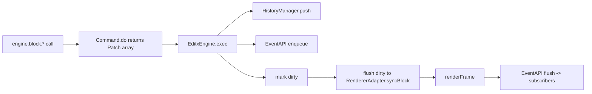
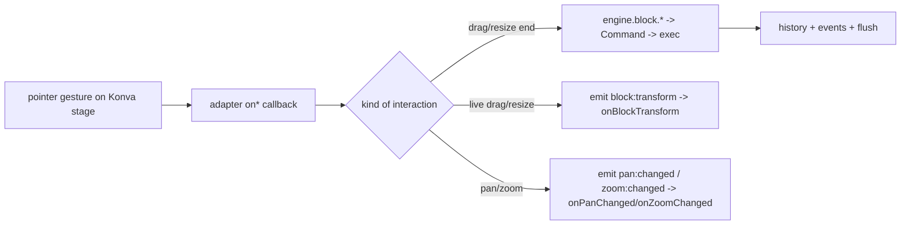

# Engine Design — editx

This is an **internal architecture guide** for contributors to `packages/engine`. It describes
how the engine is structured, how responsibilities are divided, and how a change flows from a
mutation to a rendered frame. It is intentionally distinct from the package
[`README.md`](./README.md), which covers installation and the public consumer API.

Everything reflects today's implementation; read the linked source for authoritative signatures.

## Design goals

- Keep block state a plain, serialisable data model (`BlockData`) with no renderer handles.
- Route **all** document mutations through commands so history and events stay consistent.
- Make the renderer replaceable behind a single `RendererAdapter` boundary — the engine never
  touches Konva types directly.
- Deliver block lifecycle changes to consumers as batched, deduplicated events at the end of
  each update cycle.
- Keep viewport (zoom/pan) behaviour deterministic by funnelling every camera mutation through
  shared clamp helpers.

## Module map & dependency direction

Dependencies point inward toward the data model. Sub-APIs depend on the `EngineCore` interface
rather than the concrete `EditxEngine` class to avoid circular imports.

```
consumers (apps/demo, image-editor)
        │  engine.block / engine.editor / engine.scene / engine.event
        ▼
   EditxEngine  ──────────────►  RendererAdapter (boundary)  ──► Konva impl
   (coordinator)                                                 (src/konva/)
     │  exec(command)                    ▲
     ▼                                   │ interaction callbacks
  Commands (src/controller/commands/)    │ (onBlockClick, onBlockTransform, onPanChange…)
     │  produce Patch[]                   │
     ▼                                    │
  BlockStore (src/block/)  ◄──────────────┘
     │                     HistoryManager + EventAPI observe patches
     ▼
  BlockData (plain serialisable state)
```

Key source files:

- [`src/editx-engine.ts`](./src/editx-engine.ts) — `EditxEngine`, the runtime coordinator.
- [`src/engine-core.ts`](./src/engine-core.ts) — `EngineCore`, the internal contract sub-APIs use.
- [`src/block/`](./src/block/) — `BlockStore`, `BlockAPI` facade, typed property keys.
- [`src/controller/commands/`](./src/controller/commands/) — command implementations.
- [`src/history-manager.ts`](./src/history-manager.ts) — patch-based undo/redo stack.
- [`src/event-api.ts`](./src/event-api.ts) — batched block lifecycle events.
- [`src/render-adapter.ts`](./src/render-adapter.ts) — the `RendererAdapter` boundary.
- [`src/editor/`](./src/editor/) — crop, cursor, viewport, and edit-mode helpers.
- [`src/konva/`](./src/konva/) — the concrete Konva renderer, camera, and interaction handling.

## Responsibilities

### EditxEngine — coordinator

`EditxEngine` owns the runtime wiring and exposes four sub-APIs: `block`, `editor`, `scene`, and
`event`. It does not mutate block state directly; instead it:

- executes commands (`exec`) and collects the `Patch[]` they return;
- pushes patches to `HistoryManager` and enqueues corresponding `BlockEvent`s;
- tracks a dirty set and flushes it to the renderer at the end of each cycle;
- supports `beginBatch`/`endBatch` (coalesce many patches into one history entry) and
  `beginSilent`/`endSilent` (mutate without recording history), both depth-counted for re-entrancy;
- bridges an internal string-keyed `EventBus` to the typed public callbacks
  (`onHistoryChanged`, `onZoomChanged`, `onPanChanged`, `onEditModeChanged`, `onBlockTransform`).

### Block state & typed properties

Block state lives in `BlockStore` as a map of `BlockData` — plain, serialisable records with an
`id`, `type` (`scene | page | graphic | text | image | group | effect | shape | fill`), `kind`,
children, and a typed `properties` bag. `PropertyValue` is a closed union
(`number | string | boolean | Color | TextRun[] | GradientStop[]`). Property access uses exported string
constants (e.g. `POSITION_X`, `SIZE_WIDTH`, `TEXT_RUNS`) rather than ad-hoc keys, keeping reads
and writes discoverable and consistent. `BlockAPI` is a thin facade delegating to focused
sub-APIs (property, selection, layout, crop, page, group, shape, fill, stroke, shadow, effect, text).

Shape geometry replacement uses the exported `ShapeGeometry` discriminated union and
`BlockAPI.setShapeGeometry`. The API validates and normalizes the complete descriptor before any
mutation, creates and attaches a fresh shape sub-block, updates the graphic kind, and destroys the
old sub-block in one command batch. This preserves graphic-owned styling, layout, effects,
selection, and grouping while giving undo/redo ownership of both shape lifetimes. Omitted primitive
fields use fresh shape defaults; invalid descriptors throw before history, and unsupported targets
are no-ops.

Image-filled graphics use the same command-backed fill API. `setFillImage` replaces the resolved
fill value, while `updateFillImage` patches only supplied source or transform fields. Graphic crop
is an editor session: the renderer previews parent-local frame geometry and image pattern
transforms without document writes, then `commitCrop` batches frame and fill commands into one
history entry. `cancelCrop` tears down the preview without an undo or document mutation. Source
image and page crop continue through the existing crop-overlay path. Graphic crop commits return
`null`; consumers can read the final session value before committing when they need its frame.

Graphic and text fill gradients store typed `GradientStop[]`; stroke gradients are linear. Text
run updates use half-open UTF-16 ranges and support gradients, highlights, curves, and auto width.
Block-level text backgrounds batch their enabled, geometry, padding, color, and stroke properties.

Groups store child-local transforms. Initial grouping expects siblings under one parent; grouping,
membership, and bounds-refit commands preserve appearance within that supported hierarchy and
update nested bounds. Group context navigation does not create history.

### Commands — the only mutation path

Every document mutation is a `Command` with a single `do(): Patch[]` method (see
[`commands.types.ts`](./src/controller/commands/commands.types.ts)). A `Patch` records
`{ id, before, after }` snapshots of a block; `after === null` means destroyed and
`before === null` means created. Because commands are the sole writers, history, events, and
dirty tracking are derived uniformly from the patches they emit. Sub-APIs never write to
`BlockStore` directly — they construct a command and call `engine.exec(...)`.

### EventAPI — committed lifecycle changes

`engine.event.subscribe(blocks, cb)` reports `created | updated | destroyed` events for blocks
(pass an empty array to observe all). Events are queued during command execution and delivered
**once per update cycle**, after the renderer flush, deduplicated per block with the precedence
`destroyed > created > updated`. This is the committed lifecycle stream — undo/redo re-emit the
inverse events, so subscribers stay in sync without polling.

### RendererAdapter — the rendering boundary

`RendererAdapter` is the only surface the engine uses to draw. It exposes scene setup
(`createScene`), block lifecycle (`syncBlock`, `removeBlock`, `syncChildOrder`), the transformer,
camera/viewport methods, coordinate transforms, export, crop overlay control, and a set of
optional `on*` interaction callbacks the renderer invokes back into the engine. The engine holds
no Konva references; swapping renderers means implementing this interface.

### Konva implementation — camera & interaction

`src/konva/` provides the shipped adapter. It builds the Konva stage/layers, maps `BlockData`
to Konva nodes, manages the transformer and crop overlay, and owns the camera. Pointer gestures
are translated into the adapter's `on*` callbacks, which the engine turns into commands or typed
notifications.

## Architecture & data flow

### Mutation path (consumer → rendered frame)



Under `beginBatch`/`endBatch`, patches accumulate and produce a single history entry and one
flush on `endBatch`. Under `beginSilent`/`endSilent`, patches still update state, dirty tracking,
and events, but are not pushed to history.

### Renderer-originated interaction path



Committed geometry changes (drag/transform end) go through commands like any other mutation.
Live and viewport signals are notifications only — they never touch history.

## Viewport clamping, live events & additive selection

### Zoom & pan clamping

The Konva camera funnels every viewport mutation (`setZoom`, `zoomAtPoint`, `panTo`, `panBy`,
`fitToScreen`, `fitToRect`, `centerOnRect`) through shared clamp helpers in
[`konva-camera-clamp.ts`](./src/konva/konva-camera-clamp.ts), so bounds are applied uniformly:

- Zoom is clamped to `[MIN_ZOOM, MAX_ZOOM]` (`0.05`–`20`) via `clampZoom`.
- Pan is clamped by `clampPan`: the page is centred when it fits the viewport, and cannot be
  dragged past its edges when zoomed in. Every camera method — including `fitToScreen` and
  `centerOnRect` — runs this clamp.

These bounds are internal to the Konva renderer (not re-exported from the package root).
Consumers set zoom indirectly through the editor/viewport API, which clamps internally.

### Live transform & pan callbacks

`EditxEngine` exposes typed subscriptions alongside `onHistoryChanged` / `onZoomChanged` /
`onEditModeChanged`; each returns an unsubscribe function:

- `onPanChanged((pan: { x: number; y: number }) => void)` — fires whenever the camera pan
  changes (programmatic pan, zoom re-centering, fit, resize, or animation frame).
- `onBlockTransform((e: BlockTransformEvent) => void)` — fires continuously while a block is
  dragged or resized on-canvas (`e.phase` is `"drag"` or `"resize"`).

`onBlockTransform` is a **live, pre-commit notification stream only** — it creates no history
entry. The committed mutation still arrives separately as an `updated` `BlockEvent` through
`engine.event.subscribe(...)`. Exported types: `BlockTransformEvent`, `BlockTransformPhase`,
`ViewportState`, `EditModeChange`.

### Additive (marquee) selection

The renderer reports block clicks with an internal `BlockClickEvent`
(from [`render-adapter.ts`](./src/render-adapter.ts)) carrying `shiftKey` and optional
`additive` flags:

- `additive: true` — union the block into the current selection (marquee-drag); never toggles
  or removes.
- `shiftKey: true` without `additive` — toggles a single block's selection membership.

`BlockClickEvent` is an internal renderer-adapter type, not re-exported from the package root.

## Architectural invariants

- Block state is plain, serialisable `BlockData`; it holds no renderer handles.
- Mutations happen only through commands returning `Patch[]`; nothing writes `BlockStore` directly.
- History, `BlockEvent`s, and dirty tracking are all derived from those patches.
- The engine depends on `RendererAdapter`, never on Konva types.
- Sub-APIs depend on `EngineCore`, not on the concrete `EditxEngine`, to keep imports acyclic.
- Lifecycle events are delivered once per cycle, after flush, deduplicated per block.
- Every camera mutation passes through `clampZoom` and `clampPan`.

## Extension checklist

Adding a new document mutation:

1. Add a `Command` in [`src/controller/commands/`](./src/controller/commands/) whose `do()`
   snapshots before/after and returns `Patch[]`.
2. Expose it from the relevant `BlockAPI` sub-API, calling `engine.exec(...)` (use
   `beginBatch`/`endBatch` for compound edits).
3. Add typed property keys in [`property-keys.ts`](./src/block/property-keys.ts) if introducing
   new properties, and defaults in [`block-defaults.ts`](./src/block/block-defaults.ts).

Adding renderer behaviour:

1. Extend `RendererAdapter` in [`src/render-adapter.ts`](./src/render-adapter.ts) with a
   minimal, renderer-agnostic method or `on*` callback.
2. Implement it in [`src/konva/`](./src/konva/); route camera changes through the clamp helpers.
3. Surface committed interactions as commands and live/viewport signals as typed callbacks.

Before finishing, run the engine test suite (`vitest`) covering the touched area and update this
guide plus the [`README.md`](./README.md) if the public surface changed.

## Authoritative sources

- Runtime and boundaries: [`src/editx-engine.ts`](./src/editx-engine.ts), [`src/engine-core.ts`](./src/engine-core.ts), [`src/render-adapter.ts`](./src/render-adapter.ts)
- State and mutations: [`src/block/`](./src/block/), [`src/controller/commands/`](./src/controller/commands/), [`src/history-manager.ts`](./src/history-manager.ts), [`src/event-api.ts`](./src/event-api.ts)
- Interaction and rendering: [`src/editor/`](./src/editor/), [`src/konva/`](./src/konva/)
- Consumer API and install: [`README.md`](./README.md)
